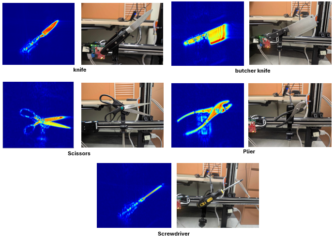
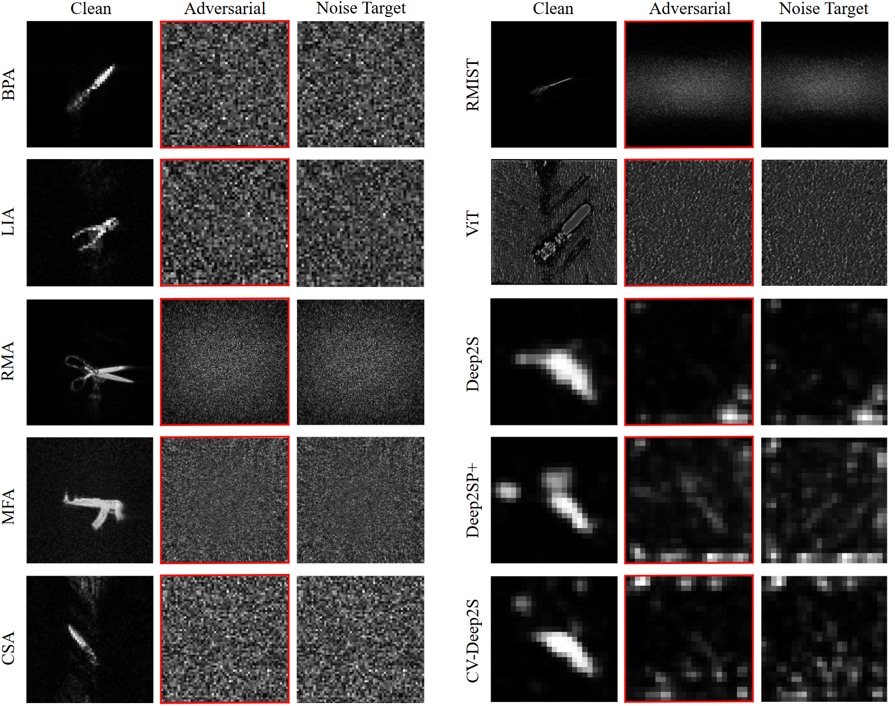
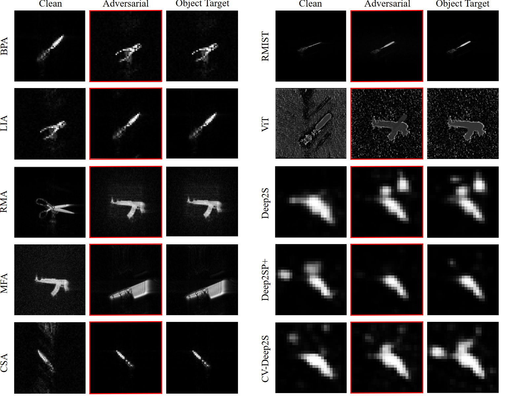
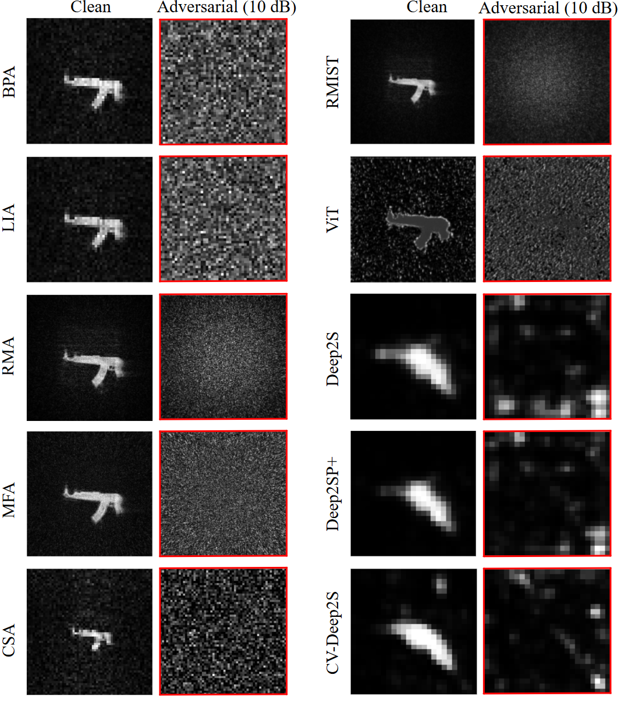

# Differential-Imaging-Attacks-on-Near-Field-SAR-Imaging
<!--
## Update on v2 (2/14/2025)
- Unified Platform: All models are now integrated into the VS Code environment, replacing the need for Google Colab or Anaconda/Jupyter Notebooks.
- Consistent Normalization: Implemented same normalization protocols across all MATLAB and Python models.
- Target Image Generation: Added functionality to generate target images using the model itself by processing randomly shuffled raw SAR data.
- Combined six variants of physics-based DNN models into a single main file to streamline adversarial attack implementation.
- Results: All preliminary attack results are now stored in the targeted_dia_results_1 directory.
---
-->
This repository contains the official implementation of **“Adversarial Robustness of Near-Field Millimeter-Wave Imaging under Waveform-Domain Attacks”.**

📁 All datasets and trained models required for the attack implementation, including files too large to host on GitHub, are available here: [data/files/trained-models](https://drive.google.com/drive/u/1/folders/1gymInr98iKLn37k7IIvvssIoM6Zd3r5P).

---

#### Adversarial Millimeter-Wave testbed

  

## Some clean images (w/o the attack) of target objects 

  

----

#### Visual comparison of imaging results under the proposed (DIA) target-conceal adversarial attack

  

----

#### Visual comparison of imaging results under the proposed (DIA) target-swap adversarial attack

  

----

#### Visual comparison of imaging results under (DIA) the random weights adversarial attack

  

### *For more details, please refer to our paper [link]*
