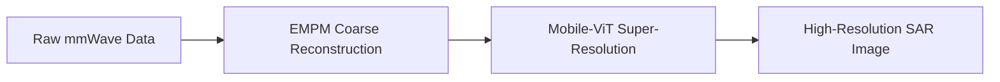
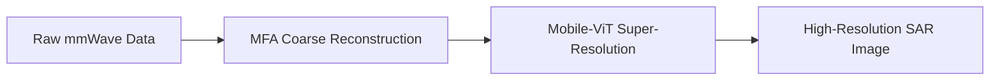

#### Differential Imaging Attack (DIA) on ViT for Near-Field Millimeter-Wave Imaging

Run for the codes in this folder to implement DIA on the Mobile-ViT model, which uses ViT archeitecture for super resoultion.

<!--
**📌 Note:**
### (Applied to Mobile-VIT) 
Our proposed differential imaging attack is applied to the Mobile-VIT model, which uses VIT archeitecture for super resoultion, introduced in the paper: [“A Vision Transformer Approach for Efficient Near-Field Irregular SAR Super-Resolution.”](https://arxiv.org/pdf/2305.02074)

(1) Because the original Mobile-ViT SAR model does not provide pretrained weights, we re-trained the network using our [synthetic SAR dataset](https://github.com/ldorje1/millisarimagenet-dataset) and the procedure described in the paper. The paper's original model information can be found [here](https://github.com/josiahwsmith10/hybrid-freehand-imaging-ViT/blob/main/get_results.ipynb). 

(2) In the original paper, the authors first applied the EMPM algorithm to obtain a coarse image estimate from the raw measurements, and then passed this estimate to Mobile-ViT for super-resolution.

Because the EMPM implementation is not publicly available, we use MFA to generate the coarse image estimate. Our Mobile-ViT implementation is shown below:

-->

<!--
***
### 📁 Files Required for the Attack Implementation  
Place all of the following files in the working directory before running the DI-Attack ([DIA_MobileViT_ch3_main](https://github.com/ldorje1/Differential-Imaging-Attacks-on-Near-Field-SAR-Imaging/blob/main/Mobile-VIT/DIA_mobileVIT_ch3_main.ipynb)) scripts:

| File | Description |
|------|-------------|
| **rawSAR.mat** | Raw SAR measurement cube. Variable: **adcDataCube** of size *(Nsamp × M × N)*, complex. |
| **D.mat** | Flattened attack dictionary. Variable: **D** of size *(Nsamp × (M·N))*, complex; generated in MATLAB. |
| **desired_attacked_complex_MFA_RMA.mat** | Desired target complex image for MFA/RMA. Variable: **sar_camouflaged** of size *(H × W)*. |
| **hffh_vit_best_epoch_050.pth** | Re-trained Mobile-ViT checkpoint used for super-resolution and attack optimization. |

*Note: The attack dictionary **D.mat** used in this implementation was generated using MATLAB.*

***

### Training Proof
Below is the training log from our Mobile-ViT retraining, showing the model converging and the best epoch selected:

***

## Re-trained Mobile-ViT Clean Results
Our retrained Mobile-ViT results:

#### (1) Mobile-VIT image generation using synthetic data (no attack)
The figure below shows the Mobile-VIT super-resolution model applied to a low-resolution mmWave SAR input, before performing any adversarial manipulation. Our trained weight `hffh_vit_best_epoch_050.pth` was used for this result.

#### (2) Mobile-VIT image generation using real measurement data (no attack)

* generated images are upside down I need fix this
  
***
## DIA on Re-trained Mobile-ViT
#### 🔧 Processing Pipeline (Mobile-ViT SAR Attack)

rawSAR → FFT → MFA → |x| → resize → Mobile-ViT → output

During the attack, we optimize a complex perturbation **ΔY** on `rawSAR` such that the Mobile-ViT output matches the jet-RGB rendering of **`desired_attacked_complex`**.

-->

